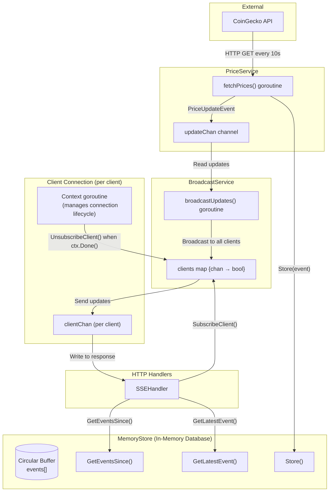

## Application workflow

```mermaid
flowchart TD
    subgraph External
        API["CoinGecko API"]
    end

    subgraph PriceService
        PF["fetchPrices() goroutine"]
        UC["updateChan channel"]
    end

    subgraph BroadcastService
        BU["broadcastUpdates() goroutine"]
        CM["clients map {chan → bool}"]
    end

    subgraph MemoryStore["MemoryStore (In-Memory Database)"]
        CB[("Circular Buffer
        events[]")]
        GES["GetEventsSince()"]
        GLE["GetLatestEvent()"]
        ST["Store()"]
    end

    subgraph "HTTP Handlers"
        SSE["SSEHandler"]
    end

    subgraph "Client Connection (per client)"
        CG["Context goroutine
        (manages connection lifecycle)"]
        CC["clientChan (per client)"]
    end
    
    %% Data flow
    API -->|"HTTP GET every 10s"| PF
    
    PF -->|"PriceUpdateEvent"| UC
    PF -->|"Store(event)"| ST
    
    UC -->|"Read updates"| BU
    
    BU -->|"Broadcast to all clients"| CM
    
    CM -->|"Send updates"| CC
    
    SSE -->|"SubscribeClient()"| CM
    SSE -->|"GetEventsSince()"| GES
    SSE -->|"GetLatestEvent()"| GLE
    
    CC -->|"Write to response"| SSE
    
    CG -->|"UnsubscribeClient() when ctx.Done()"| CM
```